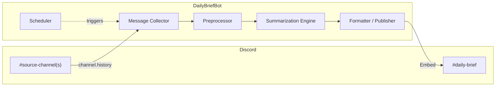
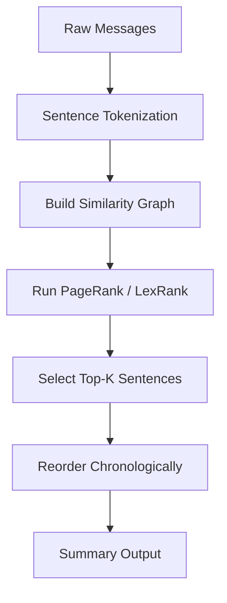
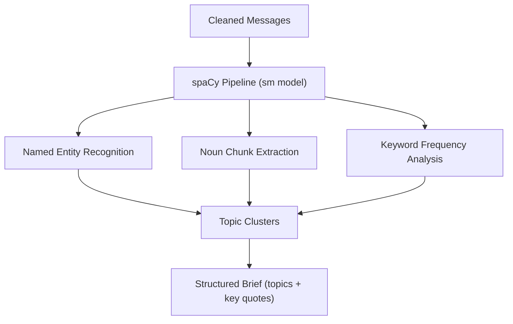
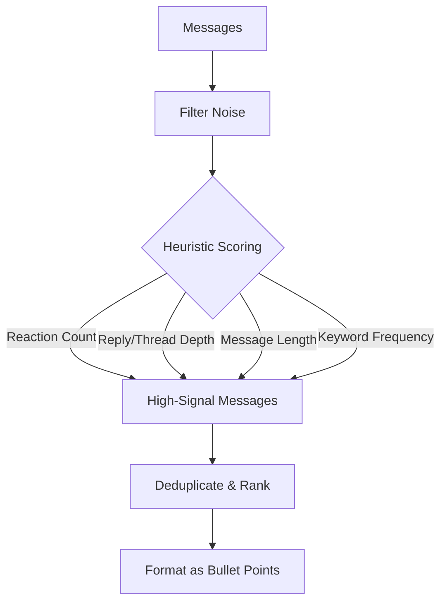
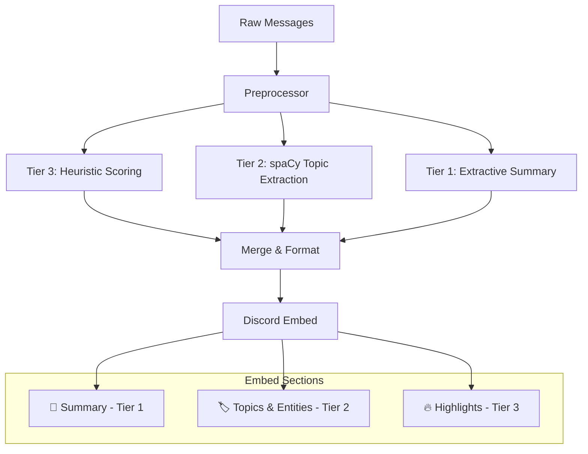
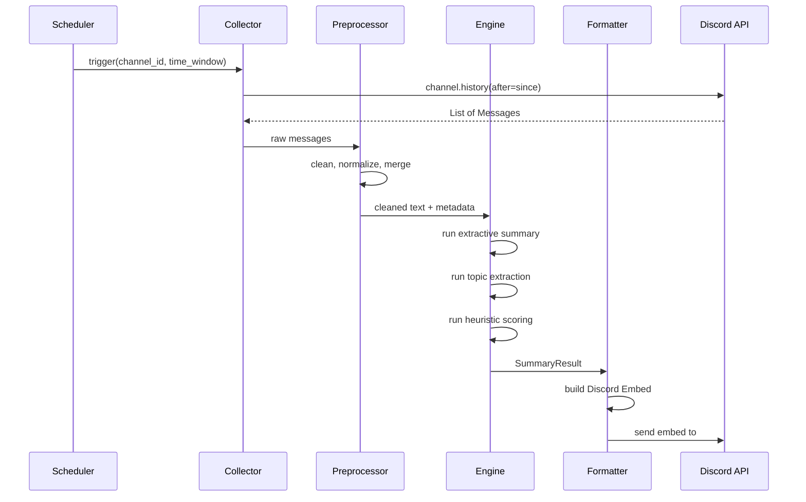

# DailyBriefBot — Architecture Design

> A Discord bot that reads conversations from source channels and posts CPU-friendly
> extractive summaries into a designated briefing channel on a configurable schedule.

---

## 1. High-Level Overview



**Core idea:** On a timer (e.g. every hour or once daily), the bot pulls recent
messages from one or more source channels, cleans and preprocesses them, runs a
lightweight extractive summarization pipeline **entirely on CPU**, and posts the
result as a rich Discord Embed into a briefing channel.

---

## 2. Design Goals

| Goal | Detail |
|------|--------|
| **CPU-only** | No GPU required. Must run comfortably on a low-end VPS or Raspberry Pi. |
| **Cheap** | Zero API costs — all summarization is local. |
| **Stateless / Privacy-first** | No message storage. Fetch → process → discard. Nothing persisted to disk or DB. |
| **Single-server** | Designed for one Discord server. No multi-guild routing needed. |
| **Configurable** | Summary window, algorithm, channel mappings, and schedule are all config-driven. |
| **Modular** | Summarization strategies are pluggable — easy to swap or A/B test. |
| **Respectful of Discord API** | Handles rate limits, uses pagination, and batches writes. |

---

## 3. Summarization Pipeline (CPU-Friendly)

The engine runs three tiers of analysis on every summary job. Since the bot
operates on a nightly or weekly schedule, CPU cost is negligible — all three
tiers together complete in milliseconds. Each tier produces a distinct section
of the output embed.

### Tier 1 — Extractive Summary Libraries (TextRank / LexRank)

These graph-based algorithms rank sentences by importance without generating new
text. They are the **primary recommended approach**.



| Library | Algorithm | Notes |
|---------|-----------|-------|
| **sumy** | TextRank, LexRank, Luhn, LSA, KL-Sum | Mature, lightweight, multiple algorithms in one package. **Recommended starting point.** |
| **pytextrank** | TextRank (spaCy plugin) | Good if we're already using spaCy for preprocessing. |
| **gensim** | TextRank variant | Heavier dependency; only worth it if we need topic modeling too. |

**Recommendation:** Start with **sumy** using LexRank. It consistently performs
well on conversational text and has zero heavy dependencies.

#### How It Works on Chat Data

1. Concatenate messages (including thread replies folded into parent channel
   context) within the time window into a pseudo-document, preserving paragraph
   breaks between different authors.
2. Sentence-tokenize the document.
3. Build a cosine-similarity graph between sentence TF-IDF vectors.
4. Run the PageRank algorithm to score each sentence.
5. Select the top *K* sentences, where **K scales with message volume**
   (default ratio: ~1 sentence per 20 messages, clamped to 3–15).
6. Re-sort selected sentences in chronological order for readability.

> **TODO:** Run a benchmark comparing LexRank vs. TextRank vs. Luhn on real
> Discord conversation data before committing to a default algorithm. Track
> results with ROUGE scores against manually written summaries.

---

### Tier 2 — Traditional NLP Pipeline (spaCy)

Use spaCy's lightweight `en_core_web_sm` model to extract structured information
that enriches or replaces pure extractive summarization.



| Component | Purpose | CPU Cost |
|-----------|---------|----------|
| **Tokenizer** | Split into words/sentences | Negligible |
| **NER** | Extract people, orgs, URLs mentioned | Low |
| **Noun Chunks** | Identify key subjects/topics | Low |
| **Lemmatizer** | Normalize words for frequency analysis | Low |

**Use cases:**
- Generating a "Topics Discussed" section (top noun chunks / entities).
- Grouping messages by detected topic before summarizing each group.
- Providing a "Key People" or "Key Links" sidebar in the embed.

> **Tip:** Disable unused spaCy pipeline components for faster processing:
> ```python
> nlp = spacy.load("en_core_web_sm", disable=["parser"])
> ```

---

### Tier 3 — Rule-Based & Statistical Heuristics

The cheapest approach — pure Python, no ML models at all. Good as a fallback or
for very low-traffic channels.



#### Heuristic Signals

| Signal | Weight | Rationale |
|--------|--------|-----------|
| **Reaction count** | High | Community has already voted on importance |
| **Reply / thread depth** | High | Active discussion = important topic |
| **Message length** | Medium | Longer messages tend to be more substantive |
| **Contains URL/attachment** | Medium | Shared resources are often noteworthy |
| **Author role weight** | Low | Admins/mods may post higher-signal content |
| **Keyword TF-IDF** | Medium | Identifies unusual/important terms vs. baseline |

#### Output Format

A simple ranked bullet list:
```
📌 Top Discussions (last 24h):
• [Topic A] — @user1 shared a link about X, sparking 12 replies
• [Topic B] — @user2 raised a question about Y (5 reactions)
• [Topic C] — @user3 posted a long write-up on Z
```

---

### Full Pipeline

All three tiers run on every summary job and feed into a single embed:



---

## 4. System Components

### 4.1 Bot Core (`bot.py`)

- Built on **discord.py** with minimal Cog usage (only for optional features).
- Requires the **`message_content`** privileged intent (must be enabled in
  the Discord Developer Portal).
- **No slash commands.** All operations are triggered automatically via configuration.
- The bot reads [`config.yaml`](config.yaml) on startup and processes all configured channels according to their schedules without any user intervention required.

### 4.2 Message Collector (`collector.py`)

Responsible for fetching messages from Discord channels.

```python
# Pseudocode
async def collect(channel_id: int, since: datetime) -> list[Message]:
    channel = bot.get_channel(channel_id)
    messages = []
    async for msg in channel.history(after=since, limit=None):
        if not msg.author.bot:  # skip bot messages
            messages.append(msg)
    # Fold thread messages into the parent channel's message list
    for thread in channel.threads:
        async for msg in thread.history(after=since, limit=None):
            if not msg.author.bot:
                messages.append(msg)
    messages.sort(key=lambda m: m.created_at)
    return messages
```

**Key considerations:**
- Uses `channel.history(after=datetime)` with pagination.
- **Threads are folded into the parent channel** — thread messages are collected
  and merged chronologically with channel messages.
- Respects Discord rate limits (discord.py handles this automatically).
- Filters out bot messages, system messages, and empty messages.
- Captures metadata: reactions, reply chains, attachments, embeds.
- **Stateless:** Messages are held in memory only during processing, then discarded.
  Nothing is written to disk or any database.

### 4.3 Preprocessor (`preprocessor.py`)

Cleans raw Discord messages into summarizer-friendly text.

| Step | Action |
|------|--------|
| **Strip mentions** | Convert `<@123456>` → `@username` |
| **Strip custom emoji** | Convert `<:name:id>` → `:name:` or remove |
| **Normalize URLs** | Shorten or label inline URLs |
| **Remove code blocks** | Optionally exclude large code pastes from summary |
| **Merge short messages** | Combine rapid-fire single-line messages from the same author |
| **Unicode normalization** | Handle emoji, special chars |

### 4.4 Summarization Engine (`engine.py`)

Pluggable strategy pattern:

```python
class SummaryStrategy(Protocol):
    def summarize(self, text: str, num_sentences: int) -> str: ...

class LexRankStrategy:
    def summarize(self, text: str, num_sentences: int = 5) -> str:
        from sumy.parsers.plaintext import PlaintextParser
        from sumy.nlp.tokenizers import Tokenizer
        from sumy.summarizers.lex_rank import LexRankSummarizer
        parser = PlaintextParser.from_string(text, Tokenizer("english"))
        summarizer = LexRankSummarizer()
        return " ".join(str(s) for s in summarizer(parser.document, num_sentences))
```

### 4.5 Formatter / Publisher (`publisher.py`)

Converts the summarization output into a polished Discord Embed and posts it.

```
┌────────────────────────────────────────────┐
│  📋 Daily Brief — #general                 │
│  June 1, 2026 • Last 24 hours              │
├────────────────────────────────────────────┤
│                                            │
│  📝 Summary                                │
│  The community discussed the new release   │
│  of version 2.0, with several members...   │
│                                            │
│  🏷️ Key Topics                             │
│  `v2.0 release` · `migration guide` ·      │
│  `API changes` · `Docker setup`            │
│                                            │
│  🔥 Highlights                             │
│  • @alice shared the migration docs (8 👍) │
│  • @bob reported a bug in the CLI (12 💬)  │
│                                            │
│  📊 Stats: 142 messages from 23 users      │
├────────────────────────────────────────────┤
│  Bot • Today at 8:00 AM                    │
└────────────────────────────────────────────┘
```

### 4.6 Scheduler (`scheduler.py`)

Uses **APScheduler** (`AsyncIOScheduler`) to trigger summary jobs.

| Trigger Type | Example | Use Case |
|-------------|---------|----------|
| `IntervalTrigger` | Every 1 hour | Frequent pulse summaries |
| `CronTrigger` | Daily at 8:00 AM | Daily digest |
| `CronTrigger` | Every Sunday at 6 PM | Weekly roundup |

```python
from apscheduler.schedulers.asyncio import AsyncIOScheduler
from apscheduler.triggers.cron import CronTrigger

scheduler = AsyncIOScheduler()

@bot.event
async def on_ready():
    scheduler.add_job(
        run_summary,
        CronTrigger(hour=8, minute=0),
        args=[source_channel_id, target_channel_id],
    )
    scheduler.start()
```

---

## 5. Data Flow



---

## 6. Configuration

All configuration lives in a single `config.yaml` (or `.env` + dataclass):

```yaml
discord:
  token: ${DISCORD_TOKEN}
  
channels:
  - source: 123456789          # channel ID to read from
    target: 987654321          # channel ID to post summary to
    schedule: "0 8 * * *"      # cron expression (daily at 8 AM)
    window_hours: 24           # how far back to look
    
  - source: 111222333
    target: 987654321
    schedule: "0 * * * *"      # every hour
    window_hours: 1

summarization:
  strategy: "lexrank"          # lexrank | textrank | luhn | lsa | heuristic
  min_messages: 5              # skip summary if fewer messages
  
  # Dynamic summary length: scales with message volume
  sentences_per_n_messages: 20 # 1 summary sentence per N messages
  min_sentences: 3             # floor
  max_sentences: 15            # ceiling
  
  heuristics:
    reaction_weight: 3.0
    reply_depth_weight: 2.0
    length_weight: 1.0
    url_bonus: 1.5

nlp:
  spacy_model: "en_core_web_sm"
  max_topics: 5
  enable_ner: true

logging:
  level: INFO
```

---

## 7. Discord API Considerations

> **Important:** The bot requires the **Message Content** privileged intent,
> which must be manually enabled in the Discord Developer Portal under
> **Bot → Privileged Gateway Intents**.

| Concern | Mitigation |
|---------|------------|
| **Rate limits** | `discord.py` handles 429s automatically; we add delays between bulk history fetches |
| **Message history limit** | Paginate with `before`/`after`; realistically ~1000–5000 msgs per window is fine |
| **Large servers** | Process channels independently; consider per-channel concurrency limits |
| **Bot permissions** | Needs: Read Message History, Send Messages, Embed Links in target channel |
| **Privileged intents** | `message_content` intent required to read message text |

---

## 8. Project Structure

```
dailybriefbot/
├── docs/
│   └── architecture.md          # this document
├── src/
│   └── dailybriefbot/
│       ├── __init__.py
│       ├── __main__.py          # entry point (reads config.yaml on startup)
│       ├── bot.py               # discord bot setup, event handlers
│       ├── collector.py         # message fetching
│       ├── preprocessor.py      # text cleaning
│       ├── engine.py            # summarization strategies
│       ├── heuristics.py        # tier 3 heuristic scoring
│       ├── topics.py            # tier 2 spaCy topic extraction
│       ├── publisher.py         # embed formatting & posting
│       ├── scheduler.py         # APScheduler integration (config-driven)
│       └── config.py            # configuration loading and validation
├── config.yaml                  # runtime configuration (all settings here)
├── requirements.txt
├── pyproject.toml
├── Dockerfile                   # for deployment
├── .env.example
└── README.md
```

**Note:** The `cogs/` directory is removed. All functionality is driven by [`config.yaml`](config.yaml) rather than slash commands or admin panels.

---

## 9. Dependencies

| Package | Version | Purpose | Size |
|---------|---------|---------|------|
| `discord.py` | ≥2.3 | Discord API client | ~2 MB |
| `sumy` | ≥0.11 | Extractive summarization (LexRank, TextRank, etc.) | ~200 KB |
| `spacy` | ≥3.7 | NLP pipeline (optional Tier 2) | ~30 MB |
| `en_core_web_sm` | ≥3.7 | spaCy English model | ~12 MB |
| `apscheduler` | ≥3.10 | Job scheduling | ~500 KB |
| `pyyaml` | ≥6.0 | Config file parsing | ~200 KB |
| `nltk` | ≥3.8 | Sentence tokenization (used by sumy) | ~10 MB |

> **Note:** Total footprint is roughly **~55 MB** installed. Compare this to a
> small LLM which would require **2–8 GB** of RAM. This bot can run on a
> $5/month VPS.

---

## 10. Implementation Roadmap

### Phase 1 — MVP (Minimum Viable Bot)
- [ ] Project scaffolding (pyproject.toml, config loading)
- [ ] Bot core with `message_content` intent
- [ ] Message collector with pagination
- [ ] Basic preprocessor (strip mentions, emoji, code blocks)
- [ ] Tier 1 summarization with sumy/LexRank
- [ ] Simple embed formatter
- [ ] Config-driven scheduler integration (APScheduler reads from [`config.yaml`](config.yaml))

### Phase 2 — Enrichment
- [ ] Tier 3 heuristic scoring (reactions, replies, length)
- [ ] Tier 2 spaCy topic extraction
- [ ] Composed summary embeds (all three tiers)
- [ ] Multi-source-channel support (single server)
- [ ] Algorithm benchmarking: LexRank vs. TextRank vs. Luhn on real Discord data

### Phase 3 — Polish & Deploy
- [ ] Dockerfile for deployment
- [ ] Graceful error handling and retry logic
- [ ] Logging and observability
- [ ] Runtime configuration validation (config-driven health checks)
- [ ] Summary quality evaluation (optional ROUGE scoring against manual summaries)
- [ ] README and setup documentation

---

## 11. Design Decisions (Resolved)

| Question | Decision | Rationale |
|----------|----------|----------|
| **Storage** | No storage — stateless | Privacy-first. Fetch → process → discard. |
| **Multi-server** | Single server only | Simplifies config and permissions. |
| **Thread handling** | Fold into parent channel | Threads are collected and merged chronologically into the channel summary. |
| **Algorithm benchmarking** | **TODO** — deferred | Will benchmark LexRank vs. TextRank vs. Luhn on real data before committing. |
| **Summary length** | Scales with message volume | ~1 sentence per 20 messages, clamped between 3–15 sentences. |
| **Commands** | No commands — purely config-driven | All operations are triggered automatically via [`config.yaml`](config.yaml). No slash commands or admin panels required. Users configure schedules and channels in the YAML file; the bot executes without user intervention. |
