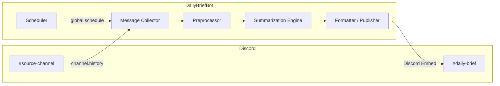
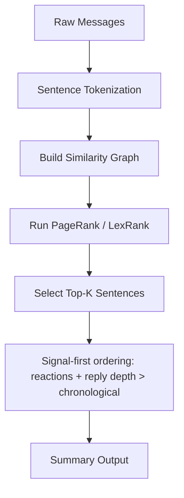
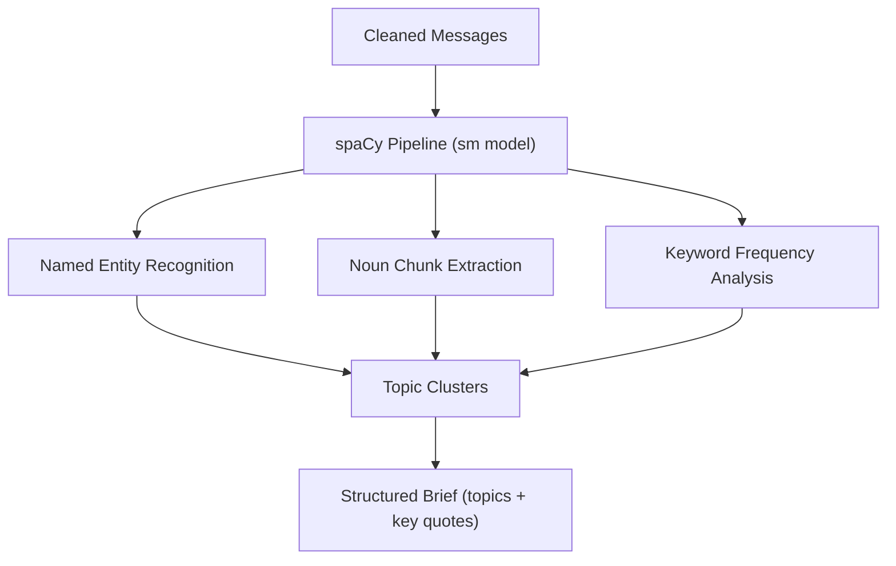
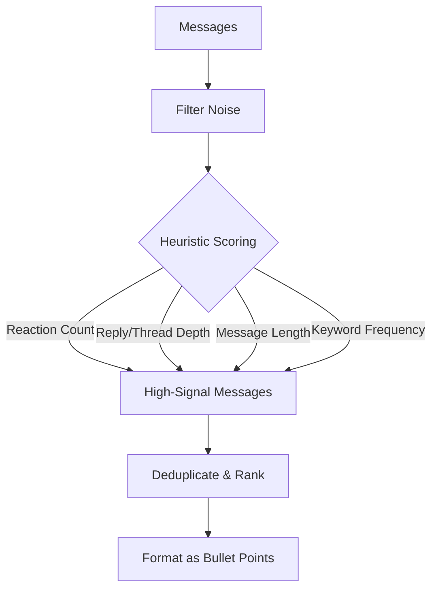
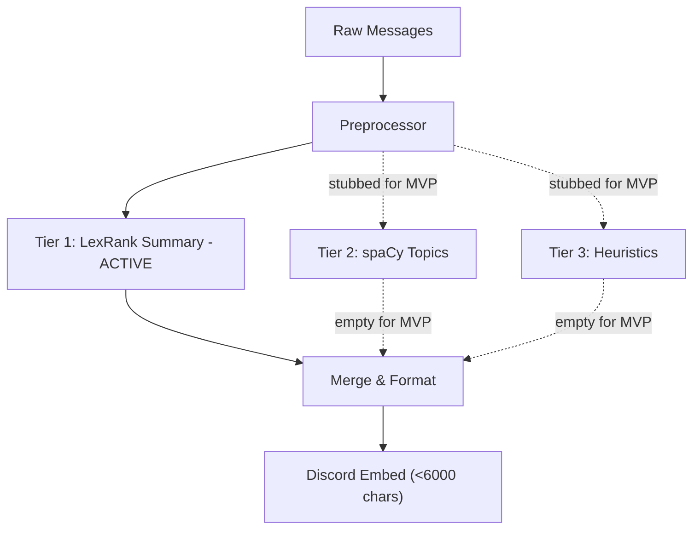
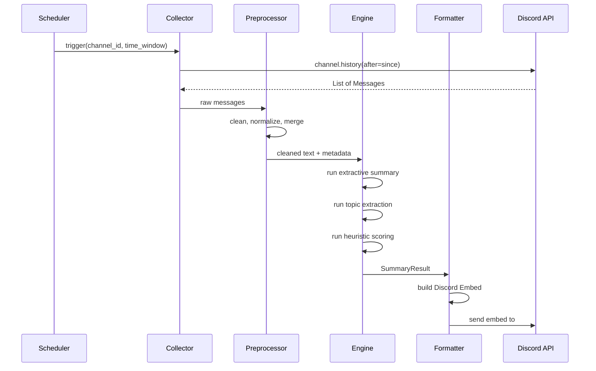

# DailyBriefBot — Architecture Design

> A Discord bot that reads conversations from source channels and posts CPU-friendly
> extractive summaries into a designated briefing channel on a configurable schedule.

---

## 1. High-Level Overview



**Core idea:** On a global timer (e.g. daily at 8 AM), the bot pulls recent messages from a single source channel, cleans and preprocesses them, runs a lightweight extractive summarization pipeline **entirely on CPU**, and posts the result as a rich Discord Embed into a briefing channel.

**MVP simplifications:**
- Single source → single target mapping (multi-channel support is future)
- No thread handling (future feature)
- Tier 2/3 summarization strategies are architecturally reserved but stubbed out for MVP

---

## 2. Design Goals

| Goal | Detail |
|------|--------|
| **CPU-only** | No GPU required. Must run comfortably on a low-end VPS or Raspberry Pi. |
| **Cheap** | Zero API costs — all summarization is local. |
| **Stateless / Privacy-first** | No message content stored. Fetch → process → discard. Job history (timestamps, counts) and logs are tracked in lightweight files (<1KB). |
| **Single-server** | Designed for one Discord server. No multi-guild routing needed. |
| **Config-driven** | Summary window, algorithm, schedules are all config-driven; no commands or admin panel for MVP. |
| **Modular** | Summarization strategies (Tier 1/2/3) are pluggable — easy to swap or A/B test. |
| **Respectful of Discord API** | Handles rate limits, uses pagination, and batches writes. |

---

## 3. Summarization Pipeline (CPU-Friendly)

The engine runs three tiers of analysis on every summary job. Since the bot
operates on a nightly or weekly schedule, CPU cost is negligible — all three
tiers together complete in milliseconds. Each tier produces a distinct section
of the output embed.

### Tier 1 — Extractive Summary Libraries (TextRank / LexRank)

These graph-based algorithms rank sentences by importance without generating new
text. They are the **primary recommended approach**. For MVP, this is the **only tier implemented**; Tier 2/3 will be added in Phase 2.



| Library | Algorithm | Notes |
|---------|-----------|------|
| **sumy** | TextRank, LexRank, Luhn, LSA, KL-Sum | Mature, lightweight, multiple algorithms in one package. **Recommended starting point.** |
| **pytextrank** | TextRank (spaCy plugin) | Good if we're already using spaCy for preprocessing. |
| **gensim** | TextRank variant | Heavier dependency; only worth it if we need topic modeling too. |

**Recommendation:** Start with **sumy** using LexRank. It consistently performs
well on conversational text and has zero heavy dependencies.

#### How It Works on Chat Data

1. Concatenate messages (excluding threads) within the time window into a pseudo-document, preserving paragraph breaks between different authors.
2. Sentence-tokenize the document.
3. Build a cosine-similarity graph between sentence TF-IDF vectors.
4. Run the PageRank algorithm to score each sentence.
5. Select the top *K* sentences: **scales with message volume** (default ratio: ~1 sentence per 20 messages, clamped to min_sentences=3–max_sentences=15).
6. Re-sort selected sentences by signal score (reaction count + reply depth weight > length) for importance-first ordering.

> **TODO:** Run a benchmark comparing LexRank vs. TextRank vs. Luhn on real Discord conversation data before committing to a default algorithm. Track results with ROUGE scores against manually written summaries.

---

### Tier 2 — Traditional NLP Pipeline (spaCy)

Use spaCy's lightweight `en_core_web_sm` model to extract structured information
that enriches or replaces pure extractive summarization.



| Component | Purpose | CPU Cost |
|-----------|---------|----------|
| **Tokenizer** | Split into words/sentences | Negligible |
| **NER** | Extract people, orgs, URLs mentioned | Low |
| **Noun Chunks** | Identify key subjects/topics | Low |
| **Lemmatizer** | Normalize words for frequency analysis | Low |

**Use cases:**
- Generating a "Topics Discussed" section (top noun chunks / entities).
- Grouping messages by detected topic before summarizing each group.
- Providing a "Key People" or "Key Links" sidebar in the embed.

> **Tip:** Disable unused spaCy pipeline components for faster processing:
> ```python
> nlp = spacy.load("en_core_web_sm", disable=["parser"])
> ```

---

### Tier 3 — Rule-Based & Statistical Heuristics

The cheapest approach — pure Python, no ML models at all. Good as a fallback or
for very low-traffic channels.



#### Heuristic Signals

| Signal | Weight | Rationale |
|--------|--------|-----------|
| **Reaction count** | High | Community has already voted on importance |
| **Reply / thread depth** | High | Active discussion = important topic |
| **Message length** | Medium | Longer messages tend to be more substantive |
| **Contains URL/attachment** | Medium | Shared resources are often noteworthy |
| **Author role weight** | Low | Admins/mods may post higher-signal content |
| **Keyword TF-IDF** | Medium | Identifies unusual/important terms vs. baseline |

#### Output Format

A simple ranked bullet list:
```
📌 Top Discussions (last 24h):
• [Topic A] — @user1 shared a link about X, sparking 12 replies
• [Topic B] — @user2 raised a question about Y (5 reactions)
• [Topic C] — @user3 posted a long write-up on Z
```

---

### Full Pipeline

All three tiers are architecturally present, but for MVP only Tier 1 is implemented (Tier 2/3 stubbed as `pass` methods):



**Embed sections:**
- 📝 Summary (Tier 1 - active)
- 🏷️ Topics & Entities (Tier 2 - stubbed, empty for MVP)
- 🔥 Highlights (Tier 3 - stubbed, empty for MVP)

**Truncation strategy:** If embed exceeds 6000 chars, shorten Tier 1 summary sentences proportionally first.

---

## 4. System Components

### 4.1 Bot Core (`bot.py`)

- Built on **discord.py** with minimal Cog usage (only for optional features).
- Requires the **`message_content`** privileged intent (must be enabled in
  the Discord Developer Portal).
- **No slash commands.** All operations are triggered automatically via configuration.
- The bot reads [`config.yaml`](config.yaml) on startup and processes all configured channels according to their schedules without any user intervention required.

### 4.2 Message Collector (`collector.py`)

Responsible for fetching messages from Discord channels.

```python
# Pseudocode
async def collect(channel_id: int, since: datetime) -> list[Message]:
    channel = bot.get_channel(channel_id)
    messages = []
    
    # Fetch main channel history (no threads for MVP)
    async for msg in channel.history(after=since, limit=None):
        if not msg.author.bot:  # skip bot/system messages
            messages.append(msg)
    
    # API call budget protection: stop if we hit the limit per job
    if len(messages) >= config.api_call_budget:
        break
    
    messages.sort(key=lambda m: m.created_at, reverse=True)  # newest first for signal scoring
    return messages
```

**Key considerations:**
- Uses `channel.history(after=datetime)` with pagination.
- **No thread support in MVP** — threads are excluded entirely (future feature).
- Respects Discord rate limits (`discord.py` handles this automatically); adds delays between bulk history fetches.
- Filters out bot messages, system messages, and empty messages.
- Captures metadata: reactions, reply chains, attachments, embeds for signal scoring.
- **Stateless:** Messages are held in memory only during processing, then discarded. Nothing is written to disk or any database.
- **API call budget:** Stops fetching after `max_calls` limit per job (default: 100) to prevent rate limit exhaustion.
- **Error recovery:** Logs malformed input errors but continues processing remaining messages (partial summary if needed).


### 4.3 Preprocessor (`preprocessor.py`)

Cleans raw Discord messages into summarizer-friendly text.

| Step | Action |
|------|--------|
| **Strip mentions** | Convert `<@123456>` → `@username` |
| **Strip custom emoji** | Convert `<:name:id>` → `:name:` or remove |
| **Normalize URLs** | Shorten or label inline URLs |
| **Remove code blocks** | Optionally exclude large code pastes from summary |
| **Merge short messages** | Combine rapid-fire single-line messages from the same author |
| **Unicode normalization** | Handle emoji, special chars |

### 4.4 Summarization Engine (`engine.py`)

Pluggable strategy pattern:

```python
class SummaryStrategy(Protocol):
    def summarize(self, text: str, num_sentences: int) -> str: ...

class LexRankStrategy:
    def summarize(self, text: str, num_sentences: int = 5) -> str:
        from sumy.parsers.plaintext import PlaintextParser
        from sumy.nlp.tokenizers import Tokenizer
        from sumy.summarizers.lex_rank import LexRankSummarizer
        parser = PlaintextParser.from_string(text, Tokenizer("english"))
        summarizer = LexRankSummarizer()
        return " ".join(str(s) for s in summarizer(parser.document, num_sentences))
```

### 4.5 Formatter / Publisher (`publisher.py`)

Converts the summarization output into a polished Discord Embed and posts it. Truncates to <6000 chars if needed by shortening Tier 1 sentences proportionally. Supports inline clickable links for high-signal messages in Phase 2+.

**MVP embed structure (no links):**
```
┌────────────────────────────────────────────┐
│  📋 Daily Brief — #general                 │
│  June 7, 2026 • Last 24 hours              │
├────────────────────────────────────────────┤
│                                            │
│  📝 Summary                                │
│  The community discussed the new release   │
│  of version 2.0, with several members...   │
│                                            │
│  🔥 Highlights                             │
│  • @alice shared migration docs (8 👍)     │
│  • @bob reported a CLI bug (12 💬)         │
├────────────────────────────────────────────┤
│  Summarizing 45 messages → 12 sentences    │
│  Bot • Today at 8:00 AM                    │
└────────────────────────────────────────────┘
```

**Phase 2+ embed with message links:**
High-signal messages (> signal_threshold score) get inline clickable links to original Discord posts. Links are capped at `max_links_per_summary` to preserve <6000 char limit.

```
📝 Summary
The community discussed v2.0 release  
@alice shared migration docs [→](#msg_id) (8 👍)  ← linked if signal > threshold
```

**Truncation strategy:** If embed exceeds 6000 chars, shorten Tier 1 summary sentences proportionally first, then remove lowest-signal links as fallback.

### 4.6 Scheduler (`scheduler.py`)

Uses **APScheduler** (`AsyncIOScheduler`) to trigger summary jobs with a **global schedule**. Job history is tracked in a tiny JSON file (~1KB) that records timestamps and success/failure — never message content.

| Trigger Type | Example | Use Case |
|-------------|---------|----------|
| `CronTrigger` | `"0 8 * * *"` (daily at 8 AM) | Daily digest (default for MVP) |
| `IntervalTrigger` | Every 6 hours | Frequent pulse summaries |

**Last-run time logic:** The scheduler tracks the last successful job execution and uses it to calculate the `since` datetime, preventing duplicate message coverage:

```python
from apscheduler.schedulers.asyncio import AsyncIOScheduler
import json
from datetime import timedelta, datetime

# On bot startup:
job_history = await JobHistory.get_last_successful()
if job_history:
    since = job_history['timestamp'] + timedelta(minutes=30)  # skip overlap
else:
    since = datetime.now() - timedelta(hours=24)  # fresh start if first run

scheduler.add_job(
    run_summary,
    CronTrigger(hour=8, minute=0),
    args=[source_channel_id, target_channel_id],
    kwargs={'since': since},  # pass calculated time window
)
```

**Job history format:** Each entry includes full execution metadata for monitoring:
```json
{
  "timestamp": "2026-06-07T08:00:00Z",
  "channel_id": 123456,
  "success": true,
  "messages_processed": 45,
  "sentences_generated": 12,
  "duration_ms": 234,
  "error_message": null          // if failed
}
```

**Log rotation:** `logs/dailybrief.log` rotates at fixed size (20MB per file) to prevent disk space exhaustion. Old logs are archived and compressed automatically.

**Error handling:** Logs errors and continues; bot does not crash on individual job failures. Check `job_history.json` periodically to monitor execution.

---

## 5. Data Flow



---

## 6. Configuration

All configuration lives in a single `config.yaml` (or `.env` + dataclass):

```yaml
discord:
  token: ${DISCORD_TOKEN}

# Single source → single target mapping for MVP
channels:
  - source: 123456789          # channel ID to read from
    target: 987654321          # channel ID to post summary to
    schedule: "0 8 * * *"      # global cron expression (daily at 8 AM)
    window_hours: 24           # how far back to look

# API call budget per job to prevent rate limit exhaustion
api_call_budget: 100

summarization:
  strategy: "lexrank"          # lexrank | textrank | luhn | heuristic
  min_messages: 5              # skip summary if fewer messages
  
  # Dynamic summary length with hard cap for MVP
  sentences_per_n_messages: 20 # ~1 sentence per N messages (scaling)
  min_sentences: 3             # floor
  max_sentences: 15            # ceiling

  heuristics:
    reaction_weight: 3.0       # signal-first: reactions + replies > length
    reply_depth_weight: 2.0
    length_weight: 1.0
    url_bonus: 1.5
  
  message_links:
    enabled: false             # MVP disabled; Phase 2 feature
    signal_threshold: 4.0      # score > this gets clickable link (reactions+replies weighted)
    max_links_per_summary: 5   # cap to preserve embed truncation buffer (<6000 chars)

  priority_users:              # NEW: Flat list of high-priority users with signal multipliers
    - id: "123456789"         # Discord User ID (numeric string)
      multiplier: 2.0          # Their signal score gets ×2 weight (Phase 2)
    - id: "987654321"
      multiplier: 3.0          # Higher priority users

  # Signal scoring with priority users:
  # base_score = (reactions × 3.0) + (reply_depth × 2.0) + (length_weight × normalized_length)
  # final_score = base_score × multiplier (if user in priority_users, else ×1.0)
  # Linking applies global signal_threshold AFTER multiplier is applied

nlp:
  spacy_model: "en_core_web_sm"
  max_topics: 5
  enable_ner: true             # Tier 2 stubbed out for MVP

logging:
  level: INFO
```

**Global schedule approach:** All channels use the same global cron expression (e.g., `"0 8 * * *"`) rather than per-channel schedules. This simplifies scheduler logic and ensures consistent timing across all summaries.

---

## 7. Discord API Considerations

> **Important:** The bot requires the **Message Content** privileged intent,
> which must be manually enabled in the Discord Developer Portal under
> **Bot → Privileged Gateway Intents**.

| Concern | Mitigation |
|---------|------------|
| **Rate limits** | `discord.py` handles 429s automatically; we add delays between bulk history fetches |
| **API call budget** | Hard limit per job (default: 100 calls) to prevent exhaustion during multi-channel runs |
| **Message history limit** | Paginate with `before`/`after`; realistically ~1000–5000 msgs per window is fine |
| **Large servers** | Process channels independently; consider per-channel concurrency limits |
| **Bot permissions** | Needs: Read Message History, Send Messages, Embed Links in target channel |
| **Privileged intents** | `message_content` intent required to read message text |

---

## 8. Project Structure

```
dailybriefbot/
├── docs/
│   └── architecture.md          # this document
├── src/
│   └── dailybriefbot/
│       ├── __init__.py
│       ├── __main__.py          # entry point (reads config.yaml on startup)
│       ├── bot.py               # discord bot setup, event handlers
│       ├── collector.py         # message fetching (no threads for MVP)
│       ├── preprocessor.py      # text cleaning
│       ├── engine.py            # summarization strategies (Tier 1 active, 2/3 stubbed)
│       ├── publisher.py         # embed formatting & posting with truncation
│       ├── scheduler.py         # APScheduler integration + job history tracking
│       ├── job_history.py       # lightweight JSON tracker (~1KB file)
│       └── config.py            # configuration loading and validation
├── config.yaml                  # runtime configuration (single channel, global schedule)
├── requirements.txt
├── pyproject.toml
├── Dockerfile                   # for deployment
├── .env.example
└── logs/                       # directory for log rotation
```

**Note:** The `cogs/` directory is removed. All functionality is driven by [`config.yaml`](config.yaml) rather than slash commands or admin panels. Tier 2 (`topics.py`) and Tier 3 (`heuristics.py`) files are stubbed out for MVP but not fully implemented (to be added in Phase 2).

---

## 9. Dependencies

| Package | Version | Purpose | Size |
|---------|---------|---------|------|
| `discord.py` | ≥2.3 | Discord API client | ~2 MB |
| `sumy` | ≥0.11 | Extractive summarization (LexRank, TextRank, etc.) | ~200 KB |
| `spacy` | ≥3.7 | NLP pipeline (optional Tier 2) | ~30 MB |
| `en_core_web_sm` | ≥3.7 | spaCy English model | ~12 MB |
| `apscheduler` | ≥3.10 | Job scheduling | ~500 KB |
| `pyyaml` | ≥6.0 | Config file parsing | ~200 KB |
| `nltk` | ≥3.8 | Sentence tokenization (used by sumy) | ~10 MB |

> **Note:** Total footprint is roughly **~55 MB** installed. Compare this to a
> small LLM which would require **2–8 GB** of RAM. This bot can run on a
> $5/month VPS.

---

## 10. Implementation Roadmap

### Phase 1 — MVP (Minimum Viable Bot)
- [ ] Project scaffolding (`pyproject.toml`, config loading + validation script)
- [ ] Bot core with `message_content` intent and startup entry point
- [ ] Message collector with pagination (no threads; API call budget limit)
- [ ] Basic preprocessor (strip mentions, emoji, code blocks, normalize text)
- [ ] Tier 1 summarization with sumy/LexRank only (Tier 2/3 stubbed as `pass` methods in `engine.py`)
- [ ] Embed formatter with truncation strategy (<6000 chars, shorten Tier 1 proportionally if needed)
- [ ] Job history tracker (`job_history.json`) for last-run time calculation and execution monitoring
- [ ] Config-driven global scheduler integration (APScheduler reads from [`config.yaml`](config.yaml))

### Phase 2 — Enrichment & Multi-channel
- [ ] Tier 3 heuristic scoring (reaction + reply depth signal-first ranking)
- [ ] **Message links for high-signal messages** (inline clickable, threshold: 4.0, max: 5 per summary)
- [ ] **Priority users configuration** (flat list of user IDs with signal multipliers in `config.yaml`)
- [ ] Tier 2 spaCy topic extraction and entity recognition
- [ ] Composed summary embeds (all three tiers populated)
- [ ] Multi-source-channel support with per-channel schedules in YAML
- [ ] Thread handling (fold into parent or separate thread embeds)
- [ ] Algorithm benchmarking: LexRank vs. TextRank vs. Luhn on real Discord data

### Phase 3 — Polish & Deploy
- [ ] Dockerfile for containerized deployment
- [ ] Graceful error handling and retry logic per job
- [ ] Structured logging with rotation (`logs/dailybrief.log`, max file size: 20MB)
- [ ] Runtime configuration validation (health checks, config-driven alerts)
- [ ] Summary quality evaluation (optional ROUGE scoring against manual summaries)
- [ ] README and setup documentation with deployment guide

### Phase 4 — User Experience & Admin Tools
- [ ] Command UI for users (`/pause`, `/status`, `/test-run`)
- [ ] Web dashboard or Discord panel for monitoring job history
- [ ] Real-time notification system (alert on summary failures)

---

## 11. Design Decisions (Resolved)

| Question | Decision | Rationale |
|----------|----------|-----------|
| **Storage** | No message storage — stateless; job history + logs allowed | Privacy-first: no PII persisted. Only timestamps/counts in ~1KB JSON file for monitoring. |
| **Multi-server** | Single server only | Simplifies config, permissions, and deployment. |
| **Thread handling** | Excluded for MVP (future) | Side conversations dilute summary quality; can be added after core pipeline is stable. |
| **Multi-channel config** | Single source → single target only (MVP); future expansion | Reduces YAML complexity and scheduler logic initially. Multi-channel supported in Phase 2. |
| **Algorithm benchmarking** | **TODO** — deferred | Will benchmark LexRank vs. TextRank vs. Luhn on real data before committing. |
| **Summary length** | Scales with message volume (1 sentence per N messages, clamped to min=3–max=15) | Balances brevity with coverage; hard cap prevents runaway embeds. |
| **Commands/UI** | No commands — purely config-driven for MVP | All operations triggered automatically via [`config.yaml`](config.yaml). Command UI is future (Phase 2+). |
| **Message links** | Inline clickable links for high-signal messages only (signal_threshold: 4.0, max_links_per_summary: 5) | Phase 2 feature; preserves embed space by capping link count and only linking to important messages (reactions/replies weighted score > 4.0). Format: `sentence [→](url)` with icon at end. Configurable in [`config.yaml`](config.yaml). |
| **Priority users** | Flat list of user IDs with configurable signal multipliers (e.g., `multiplier: 2.0`) | Phase 2 feature; high-priority users' messages get boosted signal scores before threshold comparison. Global threshold applies to all users after multiplier is applied. No role-based distinction in MVP. Validated on startup with clear error if invalid values detected. |
| **Spacy model caching** | Download once on disk, persist across restarts | Model weights ≠ PII; safe to cache (~12MB) while messages remain ephemeral. |
| **Empty channel behavior** | Skip posting entirely if zero user messages (Option A) | Avoids cluttering daily brief with empty summaries for low-traffic periods. Logs are still written. |
| **Config validation** | Hard block on startup with clear error messages | Saves hours of debugging broken configs; validates cron expressions, required fields, and strategy names. Priority users validated on startup (multiplier must be numeric > 0). |
| **Error recovery** | Log errors and continue; no crash on individual job failures | Operational resilience: bot keeps running even if one summary fails. Check `job_history.json` to monitor execution. Malformed input errors are logged but processing continues with remaining messages. |
| **Spacy model caching** | Download once on disk, persist across restarts | Model weights ≠ PII; safe to cache (~12MB) while messages remain ephemeral. |
| **Empty channel behavior** | Minimal embed: "No activity detected" | Graceful handling for low-traffic periods without clutter. |
| **Config validation** | Hard block on startup with clear error messages | Saves hours of debugging broken configs; validates cron expressions, required fields, and strategy names. |
| **Error recovery** | Log errors and continue; no crash on individual job failures | Operational resilience: bot keeps running even if one summary fails. Check `job_history.json` to monitor execution. |
